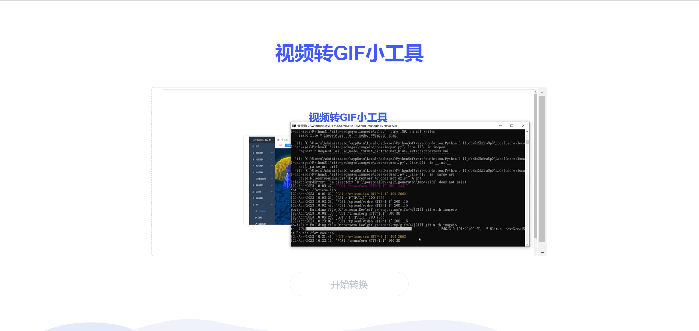

# GIF 转换工具

这是一个视频转 gif 的小工具，基于 python 实现，无论是 Windows 还是 Mac 都能用哦

这是一个值得推荐的小工具，非常好用，虽然网上也有许多转换工具，但不是有水印就是限制时长，还有的
限制宽高，转换后的结果甚是不理想，而这个工具可以解决所有问题。

效果图如下：


转换完成后，便可直接下载



继续拖拽图片到上传框或点击上传框，可重新上传视频文件。


操作演示

## 工具使用方法

- 方法一(最佳方式，使用 conda 环境)：

  1. 拷贝源码至本地：

  ```bash
  git clone https://github.com/dengxiaoning/videoToGif.git
  cd videoToGif
  ```

  2. 安装项目依赖，并切换 conda 环境：

  ```bash
  conda env create -f env.yml
  conda activate gif_generate
  ```

  3. 运行该工具

  ```bash
  python manage.py runserver
  ```

  4. 打开浏览器，地址栏输入: localhost:8000，然后尽情使用
  5. 后续要使用都很简单，打开终端输入一下两行命令，然后尽情玩耍：

  ```bash
  conda activate gif_generate
  python manage.py runserver
  ```

- 方法二(Mac 和 Linux 自带了 pip 了，Windows 需要自行安装 python3)【本人测试使用该方式】

  1. 打开终端，拷贝源码至本地：

  ```bash
  git clone https://github.com/dengxiaoning/videoToGif.git
  cd videoToGif
  ```

  2. 使用 pip 安装项目依赖，不过直接怎么操作，没有虚拟环境了呢

  ```bash
  pip install -r requirements.txt
  ```

  3. 运行该工具

  ```bash
  python manage.py runserver
  ```

  4. 打开浏览器，地址栏输入: http://127.0.0.1:8000/，然后尽情使用
  5. 后续只需要运行步骤 3 的命令即可

## 使用问题汇总：

- 如果你使用命令创建环境失败：

  ```bash
  conda env create -f env.yml
  ```

  那么可执行以下命令去完成环境构建：

  ```bash
  # 创建并进入环境，若显示环境已存在，则直接进入即可
  conda env -n fig_generate
  conda activate fig_generate

  # 在环境中安装依赖
  pip install -r requirements.txt
  conda install --channel https://conda.anaconda.org/menpo opencv
  ```

## 声明

本项目转至[gitee gif_generate](https://gitee.com/OrganizationStudy/gif_generate?_from=gitee_search)【非常感谢作者分享】；刚下载无法使用可能由于 vue 和 element 版本问题，修改 vue 和 elemnt 引入能够完成 video 转换,启动 test 和 tmp 为测试所需加入。
